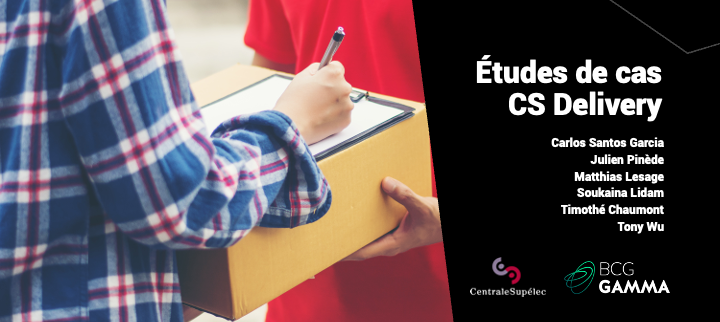
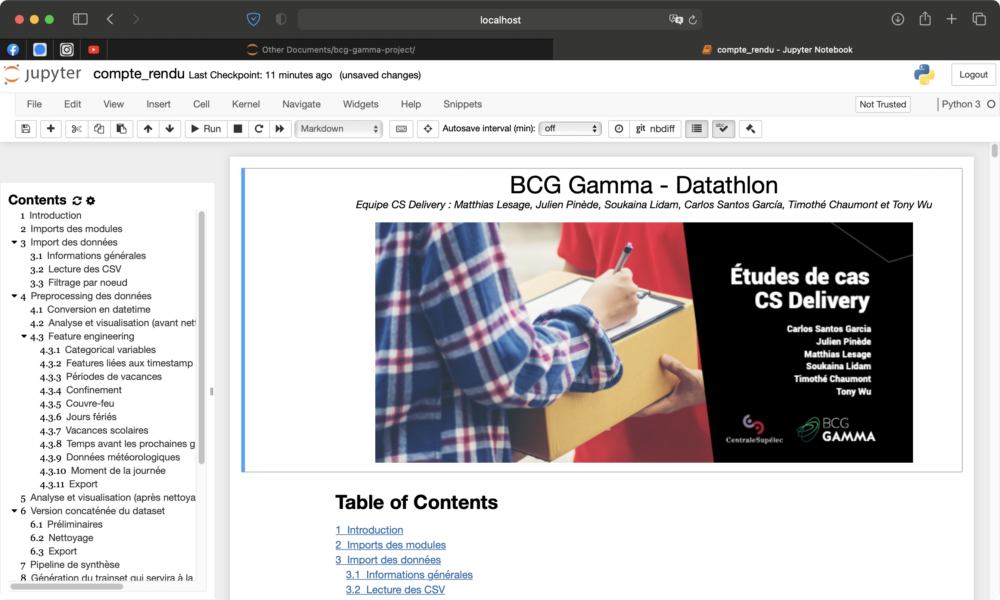

# Présentation

Ce Datathon résulte d'une collaboration entre BCG Gamma et CentraleSupélec. Sous une forme accélérée, il est une opportunité de découvrir un projet de stratégie avec une dimension DataScience.

L’étude de cas présente pour client une entreprise française opérant principalement en région parisienne du nom de *LivraisonCo*. Le CEO de cette firme désire optimiser le processus de livraison de colis. La première étape consistait à prédire l’état de trafic, puis dans un deuxième temps d'exploiter cette donnée pour définir une stratégie d’optimisation. Avec une équipe de profils diversifiés, nous avons commencé par définir nos objectifs et à spécifier le besoin. Sur le plan technique, nous avons fait un nettoyage des données et une intégration de données externes jugées utiles (météo, mesures sanitaires…) puis un test de différents modèles naïfs et complexes qui ont fourni des résultats variables. Enfin, nous avons décidé du modèle à garder et avons généré les prédictions demandées du 11 décembre au 16 décembre 2020.

# Instructions

- Télécharger le dossier `data` depuis le OneDrive du groupe :
  - https://centralesupelec-my.sharepoint.com/:f:/g/personal/matthias_lesage_student-cs_fr/EskrYrV2pypGoPoLeiXCzCUBApSXk-nZt6eLjTZiRfIgAA?e=2byoi6
- Le mettre dans la racine du projet
- Lancer le notebook `compte_rendu.ipynb`.

Preview du notebook :

En cas de problèmes, il est possible d'ouvrir  `compte_rendu.html` pour avoir un aperçu du projet.

# Remerciements

Pendant ce Datathon, nous avons eu l’opportunité de nous confronter à un problème complexe nous permettant de développer des compétences en Data Science (notamment pour le traitement des séries temporelles) et en réalisation de projet. Nous sommes d’ailleurs convaincus que le travail élaboré n’est qu’une étape primaire aussi bien pour une carrière professionnelle que pour des études plus approfondies.

À l’issue de ce travail, nous aimerions exprimer notre reconnaissance à CentraleSupélec et à BCG Gamma et plus particulièrement aux organisateurs du Datathon.

Cordialement,
L'équipe *Delivery CS*

